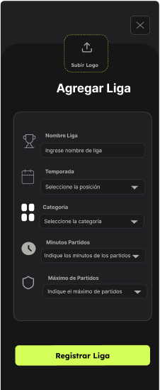

# Admistrador

El administrador tiene el control total de la aplicación. Se encarga de crear y mantener la información actualizada, organizar a los equipos y jugadores, y asegurarse de que todo funcione sin problemas. Además, es quien toma decisiones importantes dentro de la plataforma.

Puede crear equipos, añadir o eliminar jugadores, publicar convocatorias y alineaciones para los partidos, gestionar calendarios y resultados, y controlar el acceso de los usuarios. También supervisa que no haya errores y que la experiencia de uso sea correcta.


1. **Estructura de navegación.**

El apartado de _MainTabs_, disponible en modo completo para usuarios autenticados, que contiene las secciones principales de la aplicación: _Dashboard_, _Liga_, _Partidos_ y _Perfil_. Estas secciones permiten al usuario navegar entre los distintos apartados de forma sencilla mediante una barra de navegación.

```
Root
└── MainTabs (modo completo)
    ├── Dashboard
    ├── Liga
    ├── Partidos
    └── Perfil
        └── Editar perfil
```

2. **Navegación Disponible.**

Las navegaciones que podemos encontrar en nuestra aplicación a traves de un tabs son:

* **Dashboard:** Se trata de la pantalla de inicio de la aplicación, que permite visualizar la información más importante sobre la liga.
*   **Liga:** Mostrara la información de la liga.

    * Clasificación. Consultar la clasificación de la liga según los equipos.
    * Equipo. Clasificaciones según criterios como máximos goleadores, victorias, etc.
    * Jugadores. Clasificaciones de jugadores máximos goleadores, MVP, etc.

    <figure><figcaption></figcaption></figure>


* **Añadir:** Aparecera un menú flotante para añadir jugadores al equipo, equipo, liga, partidos, entrenador y delegado de campo.
*   **Partido**: Consulta el estado de los partidos.&#x20;

    * Directo. Ver los partidos en directo.
    * Programado. Ver los partidos programados.
    * Finalizado. Ver los partidos finalizados.


    <figure><figcaption></figcaption></figure>
* **Perfil:** Permite ver la información del usuario registrado.

<figure><figcaption></figcaption></figure>

3. **Comportamiento Global.**

La navegación y las funcionalidades de la aplicación para usuarios autenticados presentan un comportamiento consistente y completo:

* **Sin cabecera:**\
  Dado que el usuario ya ha iniciado sesión, no se muestran mensajes ni botones que inviten a registrarse o iniciar sesión.
* **Acceso completo según rol y permisos:**\
  Todas las secciones y acciones disponibles en la aplicación se habilitan de acuerdo con el rol del usuario.&#x20;
* **Validación de acciones sensibles:** Permite modificar información del perfil o ver información detallada de equipos, partidos e incluso jugadores.


4. **Flujo de usuario.**

El **flujo de usuario** describe cómo se desplaza un usuario autenticado dentro de la aplicación y qué acciones puede realizar en cada sección:

```
Dashboard → Información Liga
Liga → Detalle de ligas, equipos y jugadores.
Añadir → Añadir jugadores al equipo.
Partidos → Detalle de partido. 
Perfil → Editar perfil / Cerrar sesión
```

* **Dashboard**. Al iniciar sesión, el usuario accede al _Dashboard_, que funciona como pantalla principal.  Si queremos ver todos los partidos programados, debemos pulsar en el apartado “Ver todo”. Del mismo modo, para consultar los partidos en directo, es necesario pulsar el botón “En directo”.&#x20;

<figure><figcaption></figcaption></figure>

* **Liga.** Desde la sección _Liga_,  al seleccionar un equipo específico, se accede a su _detalle_, mostrando la información del equipo. Lo mismo ocurre si seleccionamos a un jugador.&#x20;

<figure><figcaption></figcaption></figure>

*   **Partido**: Dentro de esta sección, tendremos un tabs del estado en el que se encuentran los partidos (Directo, Programado, Finalizado) de la liga escogida.&#x20;

    * &#x20;**Directo**. Consultar los partidos en directo y, al seleccionar el que nos interese, en los tres puntitos podremos (cambiar estado, añadir evento, añadir alineación).


    <figure><figcaption></figcaption></figure>

    * **Programado**. Consultar los partidos programados y, al seleccionar el que nos interese, en los tres puntitos podremos (cambiar estado, añadir convocatoria).

    <figure><figcaption></figcaption></figure>

    * **Finalizado**.  Consultar los partidos programados y, al seleccionar el que nos interese, en los tres puntitos podremos (cambiar estado).

    <figure><figcaption></figcaption></figure>
*   **Perfil**: El administrador podrá observar su información personal (email, teléfono, fecha de nacimiento, género) y editar su información.

    <figure><figcaption></figcaption></figure>

Pulsando en el botón de setting se podrá:

* Cerrar Sesión.
* Roles y Usuarios. Se podrán ver los roles que existen en la aplicación y los usuarios con su rol asignado.

<figure><figcaption></figcaption></figure>

5. **Tabs principales.**

* **Dashboard:** Se trata de la pantalla de inicio de la aplicación, que permite visualizar la información más importante sobre la liga.
* **Liga:** Se consulta la clasificación de la liga con las estadísticas de todos los equipos que la forman.
* **Añadir:** Permite añadir jugadores a un equipo.
* **Partido**: Consulta el estado de los partidos (directo, programado, finalizado).&#x20;
* **Perfil:** Permite ver la información del usuario registrado.

<figure><figcaption></figcaption></figure>

7. **Asignar Roles.**

El administrador es responsable de la asignación de roles, estableciendo los niveles de acceso y permisos de cada usuario para garantizar una gestión segura y organizada. Para asignar los roles:

```
Perfil → Setting
```

Nos parecera una venta para asignar el rol que deseamos conceder:

<figure><figcaption></figcaption></figure>

7. **Añadir Liga, Editar o Eliminar Liga.**

**a. Añadir Liga.**

En una liga, los equipos se enfrentan en varios partidos (normalmente todos contra todos). Cada partido da puntos (por ejemplo, ganar, empatar o perder), y al final se hace una clasificación. El equipo con más puntos es el ganador de la liga. Para añadir una liga:

```
+ → Añadir Liga
```

Otra forma de añadir una nueva liga será a traves de:

```
Perfil → Setting → Mis ligas → +
```

Ambas nos redirigiran a una pantalla donde se deben rellenar los datos (nombre, temporada, categoria, máximo de quipos, mínimo de jugadores y una pequeña descripción), cuando se comprueben que los datos son correctos nos dirige:

<figure><figcaption></figcaption></figure>

**b. Editar y Eliminar Liga.**

A través de la opción editar y eliminar liga, el administrador puede realizar cambios en una liga sin necesidad de volver a crear una nueva, para ello debemos dirigirnos:

```
Perfil → Setting → Mis ligas
```

Nos aparecera una pantalla para donde se mostrarán todas las ligas registradas en la aplicación, si dejamos pulsado en la liga que nos interesa saldrá un menú flotante con la opción de eliminar o editar:

<figure><figcaption></figcaption></figure>

Otra forma de editar el estado de una liga es a partir de:

```
Ligas → Elipsis → Estado Liga.
```

Apareciendo una nueva ventana donde podrá los diferentes estados de las ligas:

<figure><figcaption></figcaption></figure>

Por otro lado, podremos editar la información de una liga con un menú flotante. Saldrán los campos(nombre liga, categoría, máximo de equipos, mínimo de partidos, máximo convocados, mínimo convocados, número de titulres, mínimo partidos):

<figure><figcaption></figcaption></figure>

8. **Añadir, editar o Eliminar Equipos.**

**a. Añadir Equipo**

El administrador se encarga de la gestión de equipos, incluyendo su creación, edición y organización, con el objetivo de mantener un control eficiente y facilitar el trabajo de los usuarios. Para añadir un equipo podremos hacerlo a traves de:

```
+ → Añadir Equipo
```

Otra forma de añadir un equipo a la liga podrá serlo:

```
Perfil → Setting → Mis Equipos → +
```

Ambas nos redirigiran a una pantalla donde se deben rellenar los datos (nombre equipo, ciudad, colores principales, liga, capitán entrenado, delegado de campo y nombre del estadio), cuando se comprueben que los datos son correctos nos dirige:

<figure><figcaption></figcaption></figure>

**b. Editar o Eliminar Partido.**

A través de la opción editar y eliminar liga, el administrador puede realizar cambios en una liga sin necesidad de volver a crear una nueva, para ello debemos dirigirnos:

```
Perfil → Setting → Mis Equipos
```

Nos aparecera una pantalla para donde se mostrarán todos los equipos según la liga registrados en la aplicación, si dejamos pulsado en la equipo que nos interesa saldrá un menú flotante con la opción de eliminar o editar:

<figure><figcaption></figcaption></figure>

7. **Añadir, editar o Eliminar Partidos.**

**a. Añadir Partido.**

El rol de administrador podrá añadir nuevos partidos al sistema, incluyendo información básica como equipos, fecha, hora y lugar, y también podrá editarlos o eliminarlos cuando sea necesario:

```
+ → Añadir Partido
```

Otra forma de añadir un nuevo partido será a traves de:

```
Perfil → Setting → Mis Partidos → +
```

Ambas nos redirigiran a una pantalla donde se deben rellenar los datos (nombre equipo local, nombre equipo visitante, nombre de la liga, fecha del partido, estado), cuando se comprueben que los datos son correctos nos dirige:

<figure><figcaption></figcaption></figure>

**b. Editar o Eliminar Partido.**

A través de la opción editar y eliminar partido, el administrador puede realizar cambios en un partido sin necesidad de crear uno nuevo, para ello debemos dirigirnos:

```
Perfil → Setting → Mis ligas
```

Nos aparecera una pantalla para donde se mostrarán todos los partidos registrados en la aplicación diferenciandolos por liga, si dejamos pulsado en el partido que nos interesa saldrá un menú flotante con la opción de eliminar o editar:

<figure><figcaption></figcaption></figure>

8. **Añadir Jugador.**

El rol de administrador podrá añadir jugadores al equipo que crea conveniente:

```
+ → Añadir Jugadores.
```

Nos redigirá a una pantalla de añadir jugadores. Una vez registrado los jugadores nos redigirá a Dashboard:

<figure><figcaption></figcaption></figure>

9. **Registrar Convocatoria.**

Antes de cada encuentro, el entrenador decide qué jugadores van a jugar o estar disponibles (titulares y suplentes). Esa selección se llama convocatoria. Para añadir los jugadores a la convocatoria de un partido:&#x20;

```
Partidos → Programado → Partido → Elipsis → Convocatoria
```

Nos redigirá a una pantalla de añadir convocatoria. Una vez registrado los jugadores a la convocatoria nos redigirá al Partido:

<figure><figcaption></figcaption></figure>

10. **Registrar Alineación.**

La _alineación_ es la lista de jugadores que empiezan jugando desde el inicio del partido. Para añadir los jugadores al once inicial de un partido:&#x20;

```
Partidos → Programado → Partido → Elipsis → Alineación
Partidos → En Directo → Partido → Elipsis → Alineación
```

Nos redigirá a una pantalla de añadir alineación. Una vez registrado los jugadores a la alineación nos redigirá al Partido:

<figure><figcaption></figcaption></figure>

11. **Evento.**

Para observar los eventos que tenemos podemos ir:

```
Partidos → En directo → Partido → Elipsis → Mis Evento
```

Vemos los eventos que tenemos, si dejamos pulsado en el evento que nos interesa saldrá un menú flotante con la opción de eliminar o editar:

<figure><figcaption></figcaption></figure>

En el caso de que queramos crear un evento pulsamos en '+', escogemos el evento y nos dirigira al evento que hemos seleccionado:

<figure><figcaption></figcaption></figure>

12. **Estado Partidos.**

Los partidos pueden modificarse para cambiar el estado en el que se encuentran (en directo, programado o finalizado).

```
Partidos → En directo → Partido → Elipsis → Estado
Partidos → Programado → Partido → Elipsis → Estado
Partidos → Finalizado → Partido → Elipsis → Estado
```

Todas las pantallas redigiran a cambiar estado Partido, una ver seleccionado pulsaremos el botón de 'Restablecer Estado':

<figure><figcaption></figcaption></figure>

13. **Restricciones.**

El administrador no contiene ninguna restricción contiene todos los permisos de la aplicación.
