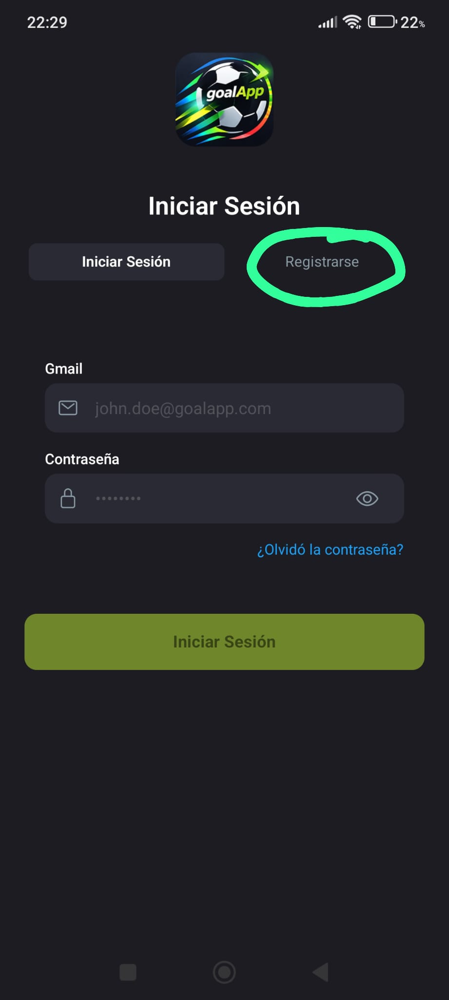
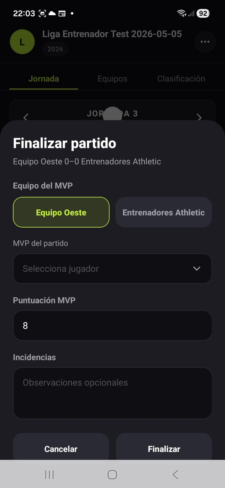

# Delegado de campo

PRIMER PASO: PROCESO DE CREACIÓN DE USUARIO

En caso de que sea la primera vez que se accede a la plataforma goalApp, será necesario completar el proceso de registro. Para ello, el usuario deberá introducir:

· Un nombre de usuario.

· Una dirección de correo electrónico de Gmail válida.

· Una contraseña creada por él mismo, la cual deberá ser repetida con el fin de evitar posibles errores durante el proceso.











No obstante, si el usuario ya dispone de una cuenta previamente creada en la plataforma, no será preciso repetir de nuevo el proceso de creación de cuenta. Únicamente deberá iniciar sesión introduciendo sus credenciales correspondientes, es decir, la dirección de correo electrónico asociada a la cuenta y la contraseña establecida durante el proceso de alta. Este procedimiento permitirá a nuestros usuarios verificar su identidad, garantizando un acceso seguro y personalizado a la plataforma.











**SEGUNDO PASO: ACCEDER A UNA LIGA**

Posteriormente, el usuario deberá pulsar el botón “Entrar” para poder acceder a la liga previamente configurada. Una vez allí, el sistema redirigirá al usuario al panel dashboard.











**TERCER PASO: EDITAR PARTIDO**

Para generar una alineación, debemos dirigirnos a la parte inferior de la pantalla, donde se encuentra el apartado “Calendario”.

Una vez allí, haremos clic en "Jornada/ Programados”. Al acceder, se mostrarán todos los partidos programados correspondientes a esa jornada.

A continuación pulsaremos en “Editar” en su interior se abrirá una ventana desde la que podremos modificar los siguientes datos del partido:

* Fecha de inicio del partido
* Hora de inicio
* Estado del partido, donde se mostrarán las siguientes opciones:
* Programado: el partido se encuentra activo y pendiente de disputarse.
* Cancelado: el partido no se jugará.
* Suspendido: el partido ha sido aplazado o detenido debido a alguna incidencia técnica.











**CUARTO PASO: INICIAR PARTIDO**

Para generar una alineación, debemos dirigirnos a la parte inferior de la pantalla, donde se encuentra el apartado “Calendario”.

Una vez allí, haremos clic en "Jornada/Programados”. A continuación nos dará la opción de iniciar el partido.

Al hacer clic en “Iniciar” nos llevará a un menú con los datos de ambos equipos que se van a enfrentar, junto con la fecha y hora que se disputará dicho encuentro.


{% column width="50%" %}



{% column width="50%" valign="middle" %}




Posteriormente daremos clic en “Iniciar partido”. De inmediato nos llevará al partido que se está disputando, en el apartado de “en vivo”, indicando que hay un partido en curso.











**QUINTO PASO: FINALIZAR PARTIDO**

Una vez que el partido concluya, se pulsará en la opción “terminar”. Dicha opción nos mostrará los datos del partido que ha terminado. En dicha pestaña podremos elegir el MVP del partido (el mejor jugador del partido), su puntuación y las incidencias del encuentro. Cuando los datos que pongamos sean los correctos y estemos seguros, cliqueamos en “Finalizar”.

**SEXTO PASO: VER EQUIPOS**

Para generar una alineación, debemos dirigirnos a la parte inferior de la pantalla, donde se encuentra el apartado “Calendario”.

Una vez allí, haremos clic en “Equipos”. A continuación nos dará la opción de iniciar el partido. A la derecha de dicho apartado nos muestra la sección de “Equipos”. Al pulsar, la pantalla nos muestra el listado de los equipos inscritos en la liga.

En la parte superior, bajo el menú “equipos” se indica que hay un total de 9 clubes en dicha liga, que podremos editar según el número de equipos haya. También se visualizan tarjetas individuales para cada club. Cada tarjeta contiene:

* Avatar o Logo: Con un círculo a la izquierda.
* Nombre del equipo: Ejemplos visibles serían “Entrenadores UD” o “Equipo norte”
* Indicador de Estado: Una etiqueta a la derecha con un punto verde que dice “Activo”, confirmando que el equipo está habilitado en la competición

Al clicar en cualquiera de los clubes de la competición, nos dará información precisa de los datos de la temporada así como el próximo encuentro que disputan. Los datos de la temporada se muestran con las siguientes siglas:

* PV: Partidos Jugados
* “V”, “E” y/o “D”: Victoria, empate o Derrota
* “GF” y “GC”: Goles a favor y goles en contra
* DG: Diferencia de goles
* PTS: Puntos que lleva dicho equipo
* Win%: que nos indica las posibilidades que tiene el club de ganar el partido
* La posición que ocupa en la tabla, abreviado con “Pos”

**SÉPTIMO PASO: CLASIFICACIÓN**

Para ver la clasificación de la liga, debemos dirigirnos a la parte inferior de la pantalla, donde se encuentra el apartado “Calendario”.

Una vez allí, haremos clic en “Clasificación”. Posteriormente nos mostrará una tabla con los nombres de los equipos que conforman la liga, con su respectivo número de posición en la competición a la izquierda. A la derecha del nombre, nos mostrarán datos más exactos, como los PJ, las victorias o la diferencia de goles. 

**OCTAVO PASO: ESTADÍSTICAS**

Para ver las estadísticas de la liga, debemos dirigirnos a la parte inferior de la pantalla, donde se encuentra el apartado “Estadísticas”. Al clicar nos aparecerá en la parte superior de la pantalla cuatro tarjetas de resumen con bordes de diferentes colores, cada uno con un icono representativo:

* Goles (Verde): Icono de un balón de fútbol
* Amarillas (Amarillo): Icono de una tarjeta
* Rojas (Rojo): Icono de una tarjeta, en este caso roja
* Partidos (Azul): Icono de un calendario

Por último debajo de las tarjetas nos aparece los goles por equipo, indicándonos cuantos goles lleva cada equipo, como su propio nombre indica.

**NOVENO PASO: USUARIO**

Para ver nuestros datos como usuario, debemos clicar en la barra inferior, en el extremo derecho en la sección “perfil”. Una vez accedemos nos sale una tarjeta donde nos muestra nuestra información personal. Aparece una tarjeta con la que podemos cerrar sesión.











\
Por último en la esquina superior derecha, si clicamos podremos personalizar y cambiar nuestros datos e información personal.










